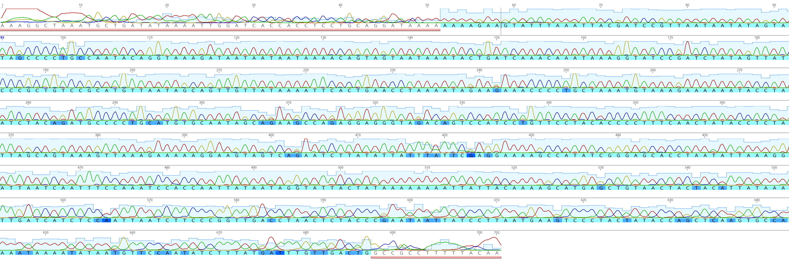
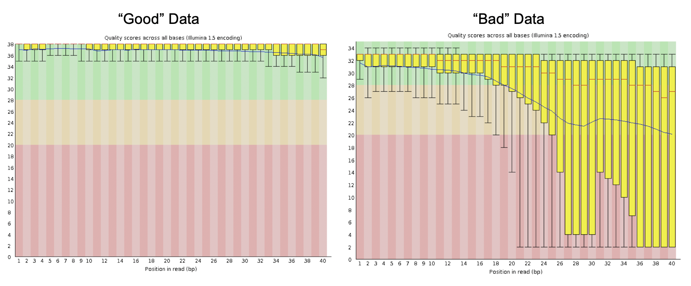
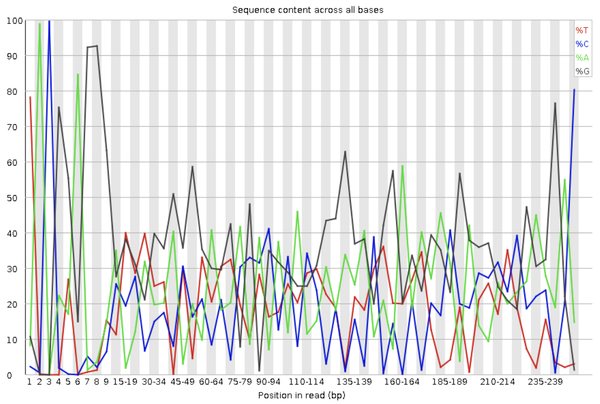
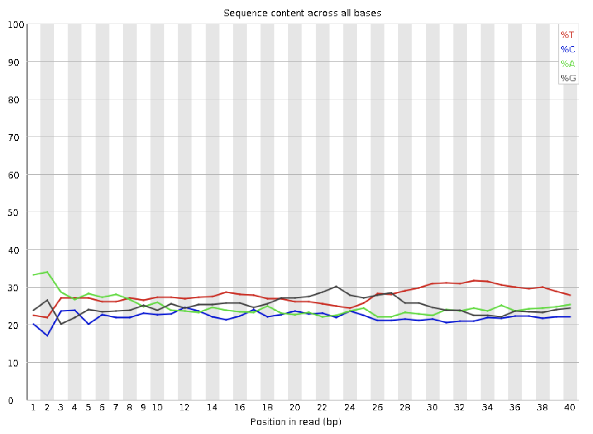

# How do we assess NGS read quality?

### GOALS

1.) Understand NGS data format and quality scores <br>

2.) Perform quality checks on NGS data <br>

3.) Learn about quality assessment in NGS reads <br>

## NGS Data and Quality
When observing sanger sequencing data, we can very easily assess quality by viewing chromatograms and manually trimming and editing sequences.

 
*Sanger sequencing data chromatograms. You can easily determine quality sequences and trim by hand.*

However, NGS produces millions of sequences that can’t be viewed manually. So how can we determine the quality of our NGS reads? 

First, let's look at some NGS data. Many NGS reads are delivered from sequencers in `.fastq` format. the `.fastq` format looks like this:

```
@SRR2584863.1 HWI-ST957:244:H73TDADXX:1:1101:4712:2181/1
>TTCACATCCTGACCATTCAGTTGAGCAAAATAGTTCTTCAGTGCCTGTTTAACCGAGTCACGCAGGGGTTTTTGGGTTACCTGATCCTGAGAGTTAACGGTAGAAACGGTCAGTACGTCAGAATTTACGCGTTGTTCGAACATAGTTCTG
>+
>CCCFFFFFGHHHHJIJJJJIJJJIIJJJJIIIJJGFIIIJEDDFEGGJIFHHJIJJDECCGGEGIIJFHFFFACD:BBBDDACCCCAA@@CA@C>C3>@5(8&>C:9?8+89<4(:83825C(:A#########################
```
1.) The first line contains an @, followed by identification information. This first line will vary depending on sequencing platform, sequencing run, and individual sequence information. <br>

2.) The second line contains the actual sequence generated. <br>

> Reflection: <br>
> Assuming this was an Illumina sequencing run, did this sequence come from a 75, 150, or 300 cycle kit? Why?

3.) The third line contains the read quality information and is based on the following scale (! being the lowest quality, and ~ being the highest quality):

```
!"#$%&'()*+,-./0123456789:;<=>?@ABCDEFGHIJKLMNOPQRSTUVWXYZ[\]^_`abcdefghijklmnopqrstuvwxyz{|}~
```
> Reflection: <br>
> Where are the lowest quality bases located? Why do you think this is?

Now, we could easily interpret the quality of this sequence by hand, but again, NGS is producing millions (or up to billions!) of these reads, so we can't visually inspect them. Instead, we have to rely on software programs to scan our sequence files and give us easy to read quality reports. 

## Performing QC on NGS reads

There are many quality assessment programs, but one of the most commonly used is [FastQC](https://www.bioinformatics.babraham.ac.uk/projects/fastqc/). FastQC was developed in 2010 by individuals at the Babraham Institute and has since become one of the most widely used quality assessment platforms in NGS, and is even incorporated within Illumina BaseSpace Labs. 

The program can be run on your local machine, on an HPC, or miniconda. Whatever method you choose, fastQC is run very easily. Navigate to your directory containing all your `.fastq` or `.fastq.gz` (zipped) and run the command:

`fastqc *.fastq*`

If the program is running correctly, you will see a progress report:

```
Started analysis of xxxxx_1.fastq
Approx 5% complete for xxxxx_1.fastq
Approx 10% complete for xxxxx_1.fastq
Approx 15% complete for xxxxx_1.fastq
Approx 20% complete for xxxxx_1.fastq
Approx 25% complete for xxxxx_1.fastq
Approx 30% complete for xxxxx_1.fastq
Approx 35% complete for xxxxx_1.fastq
Approx 40% complete for xxxxx_1.fastq
Approx 45% complete for xxxxx_1.fastq
....
Approx 80% complete for xxxxx_2.fastq.gz
Approx 85% complete for xxxxx_2.fastq.gz
Approx 90% complete for xxxxx_2.fastq.gz
Approx 95% complete for xxxxx_2.fastq.gz
Analysis complete for xxxxx_2.fastq.gz
```

Once the program has finished running, two sets of files will be generated for every sample: a `sample01.fastqc.html` and a `sample_01.zip`. The html files can be viewed on any web browser (*Tip: highlight all samples and hit the `space` key to easily tab through all files*).

This is easy enough, but having a more comprehensive output is much more useful for interpreting patterns across many samples. We can use [MultiQC](https://multiqc.info/) (Ewells et al. 2016) for this. This program will take all of our FastQC outputs for every sample and create a single report that is interactive. 

To run: 

1.) Install locally, using Pypl, Bioconda, or utilize within GALAXY. <br>

2.) Navigate to your `FastQC.zip` directory (not the `.html` directory) <br>

3.) Run MultiQC <br>

`multiqc .` <br>

4.) That's it! You will generate a MultiQC directory that contains tab-delimited information, but the easiest way to navigate your output is to view the `multiqc_report.html`. 

##  Understanding QC results for NGS reads

FastQC reports contain the following results about sequence quality:

#### Basic Statistics
#### Per base sequence quality
#### Per sequence quality scores
#### Per base sequence content
#### Per sequence GC content
#### Per base N content
#### Sequence Length Distribution
#### Sequence Duplication Levels
#### Overrepresented sequences
#### Adapter Content
#### Kmer Content

Now that we have run our QC programs, we need to be able to interpret the results. Running QC is useless if we don't understand what the results mean and what they mean for our data.
For example, FasQC and MultiQC will bin the results as normal (green tick), slightly abnormal (orange triangle) or very unusual (red cross). What does normal even *MEAN?*

All of these interpretations begin with understanding your type of data. For example, the FastQC quality default assumes a completely random and diverse library. However, our libraries may have inherent biases that violate these assumptions. For example, amplicon libraries will almost always have over represented sequences and poor per base sequence content. We will discuss more below.

Let's understand what each result can tell us about our data and potential quality issues:

### BASIC STATISTICS
Information about input FASTQ file name, type, and encoding. Also contains the number of total sequences, filtered sequences, length, and GC content.

### PER BASE SEQUENCE QUALITY
A box-and-whisker plot indicating the quality (Q-scores) of each base in your reads. The X-axis represents the position of each base (dependent on your read lengths) and the Y-axis indicates the quality score. 

1.) Green indicates Q-scores ≥ 28 <br>

2.) Yellow indicates Q-scores between 22 and 28 <br>

3.) Red indicates Q-scores less than 22 <br>

Yellow boxes indicate the 25th and 75th percentile, and the whiskers represent the 10th and 90th percentile.
The red line indicates the median score, and the blue line represents the mean. 

##### What should they look like?
Typically, you want to see most of your data with Q-scores ≥ 28. However, most Illumina data will have a noticeable decrease in quality towards the end of the reads. Tjis is typically due to exhaustion of resources in sequencing.


*Example of quality scores*

>Reflection: <br>
> How can poor sequence quality indicate problems in sequencing or your library prep?

### PER SEQUENCE QUALITY SCORES
A plot of number of reads and the average quality score over the length of the read. The X-axis represents quality scores and the Y-axis represents the number of sequences with the aligned quality.

##### What should they look like?
There should be a large peak and tight distribution around the higher quality scores. There may be a secondary peak of lower quality reads due to sequencing near the edge of a flow cell. If there are many sequences with low quality, it could indicate a problem with your sequencing flow cell.

### PER BASE SEQUENCE CONTENT
A plot that exhibits the proportion of each base sequenced in all reads. The X-axis represents the position in the read, and the Y-axis indicates percentage.

##### What should they look like?
This is a major area where different library types will reflect different charts and different distinction of "passing" by FastQC. 


*Example of per base sequence content from an amplicon sequencing library.*


*Example of per base sequence content from a whole shotgun sequencing library.*


*Example of per base sequence content from an RNA-Seq library.*

### PER SEQUENCE GC CONTENT
A plot of the QC content of the reads. The X-axis represents the GC% and the Y-axis indicates the number of reads. The displayed Theoretical Distribution assumes a normal distribution of GC content.

##### What should they look like?
Randomized whole shotgun sequencing is expected to have a normal GC content distribution. However, sometimes RNA-Seq may have transcripts that have non-normally distributed GC content.

### PER BASE N CONTENT
The percentage of bases at each position with an "N" base call.

##### What should they look like?
A noticeable percentage of N calls may indicate a problem during sequencing.

### SEQUENCE DUPLICATION LEVELS
A plot indicating the percentage of unique reads present (i.e. appear only once). The X-axis represents the sequence duplication number and the Y-axis represents the percentage.
Most often, high number of duplicate sequences indicate PCR over-amplification. This can be a problem because you will misrepresent the proportion of sequences in your sample.

##### What should they look like?
Whole shotgun sequencing: The sequence duplication level should be very low. In theory, nearly all of your reads should be completely unique. However, as you sequence more deeply (100x), you may expect a higher number of duplicate sequences. 
RNA-Seq will vary depending on what transcripts are highly and lowly expressed.

### OVERREPRESENTED SEQUENCES
A list of all the sequence which make up more than 0.1% of the total. Only the first 50bp of the first 10,000 reads are reported.

##### What should they look like?
Random libraries should not have overrepresented sequences, but may contain sequences identified as adapter sequences. Amplicon libraries will likely have highly overrepresented sequences, and RNA-Seq libraries may have very highly expressed transcripts that will be identified as overrepresented.

### ADAPTER CONTENT
A plot depicting certain adapter sequence content. The X-axis indicates the position in the read and the Y-axis represents the adapter percentage. Only the most common adapters are searched in this module.

##### What should they look like?
Typically, you shouldn't see adapter content, but longer read lengths with shorter inserts may allow for sequencing through the adapters on the 3' end. In RNA-Seq, variability and length of inserts can produce adapter sequences. Adapters are very easy to trim and remove with many programs.

### KMER CONTENT
A plot of each short nucleotide of length k (default = 7) starting at each positon along the read. Any given Kmer should be evenly represented across the length of the read. The top 6 most biased Kmer are plotted to show their distribution.

### FASTQC RESULTS FOR ALTERNATE LIBRARY TYPES OR LIBRARIES WITH SPECIFIC PROBLEMS (from [Michigan State University](https://rtsf.natsci.msu.edu/genomics/tech-notes/fastqc-tutorial-and-faq/))
 
#### SMALL (MICRO) RNA
Small RNA libraries typically consist of a relatively small set of unique, short sequences. Small RNA libraries are not randomly sheared before adding sequencing adapters to their ends meaning all the reads for specific classes of miRNA will be identical.

Expected results are:

Extremely biased per base sequence content <br>

Extremely narrow distribution of GC content <br>

Very high sequence duplication levels <br>

Abundance of overrepresented sequences <br>

Read through into adapters <br>

[Small RNA library FastQC report](SmallRNASeq_R1_001_fastqc.html)

#### AMPLICON/METAGENOMICS
Amplicon libraries are prepared by PCR amplification of a specific target, for example the V4 hypervariable region of the bacterial 16S rRNA gene. All reads from this type of library are expected to be nearly identical.

Expected results are:

Extremely biased per base sequence content <br>

Extremely narrow distribution of GC content <br>

Very high sequence duplication levels <br>

Abundance of overrepresented sequences <br>

In cases where the PCR target is shorter than the read length, the sequence will read through into adapters <br>

[Amplicon library FastQC report](AmpliconSeq_R1_001_fastqc.html)

#### BISULFITE-SEQ/BS-SEQ/METHYL-SEQ
Bisulfite (methyl) Seq libraries have had the majority of the cytosine (C) bases converted to thymine (T).

Expected results:

Biased per base sequence content <br>

Biased per sequence GC content <br>

[BS-Seq library FastQC report](MethylSeq_R1_001_fastqc.html)

#### ADAPTER DIMER CONTAMINATION
Any library type may contain a very small percentage of adapter dimer (i.e. no insert) fragments; these are more likely to be found in amplicon libraries constructed entirely by PCR (by formation of PCR primer-dimers) than in DNA-Seq or RNA-Seq libraries constructed by adapter ligation. If a sufficient fraction of the library is adapter dimer it will become noticeable in the FastQC report.

Expected observations with adapter dimer contamination:

Drop in per base sequence quality after base 60 <br>

Possible bi-modal distribution of per sequence quality scores <br>

Distinct pattern observed in per bases sequence content up to base 60 <br>

Spike in per sequence GC content <br>

Overrepresented sequence matching adapter <br>

Adapter content > 0% starting at base 1 <br>

[Adapter dimer containing library FastQC report](AdapterDimer_R1_001_fastqc 2.html)
