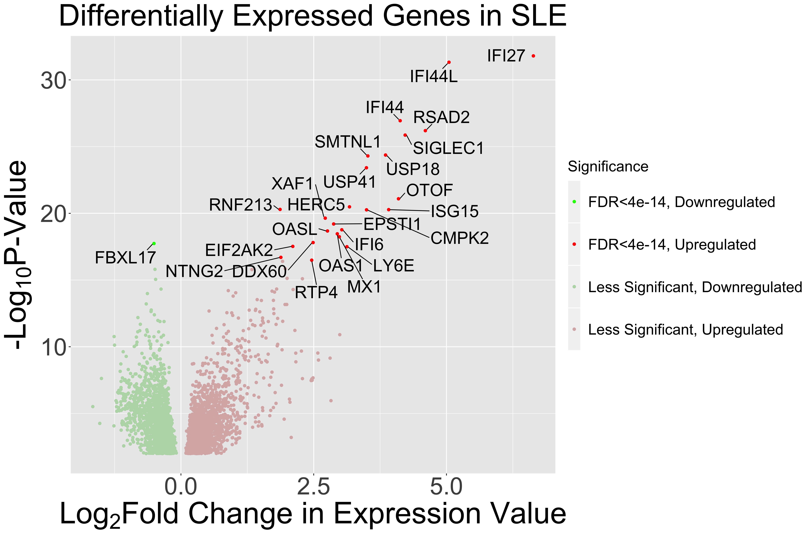

# Volcano Plots



Volcano plots are used to visualize the results of differential gene expression analysis.

In this module, we will construct a volcano plot for real data generated from an RNA-seq analysis of Systemic Lupus Erythematosus.

Dots in a volcano plot typically represent genes, a volcano plot's y-axis indicates the -log(p-value) and the x-axis indicates the log fold change in expression value. As such, dots in the upper right of the plot indicate genes with high, positive log fold change values which are very statistically significant (low p-value).

We will create our volcano plot in RStudio.

Open RStudio and create a new R Script by clicking File->New File->R Script

Save the file as "VolcanoPlot.R" and Session->Set Working Directory->To Source File Location

Make sure you have the differential expression data (AllDifferentiallyExpressed.csv) in the same directory.

We will load our libraries first:

```
library(ggplot2)
```

Next we will load our data

```
genes <- read.csv(file="AllDifferentiallyExpressed.csv", header=TRUE, sep=",")
```

We will identify the upregulated and downregulated genes:

```
sigUp <- which(genes$log2FoldChange>0
sigDown <- which(genes$log2FoldChange<0
```

We will add a column called "Direction" that will indicate whether the gene is down or upregulated

```
genes$Direction <- "Upregulated"
genes[ sigUp, "Direction"] <- "Upregulated"
genes[ sigDown, "Direction"] <- "Downregulated"
```

We can now plot our table:

```
ggplot(genes, aes(x = log2FoldChange, y = -log10(pvalue))) +
  geom_point(aes(color = Significance)) +
  scale_color_manual(values = c("green1", "red")) +
  xlab(expression('Log'[2]*'Fold Change in Expression Value')) +
  ylab(expression('-Log'[10]*'P-Value')) +
  ggtitle("Differentially Expressed Genes in SLE") +
  theme(text = element_text(size = 40),
        legend.position = "right", plot.title = element_text(hjust = 0.5, size=40),
        legend.text = element_text(size = 20),
        legend.title = element_text(size = 20),
        legend.key.height=unit(2, "cm"))

```
And We can save the plot by executing the command:

```
ggsave("VolcanoPlot.png", plot = last_plot(), height = 10, width=15, device = "png", dpi = 500, limitsize = FALSE)
```
