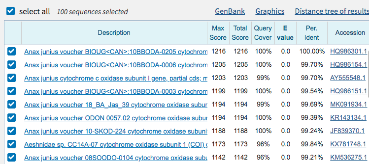
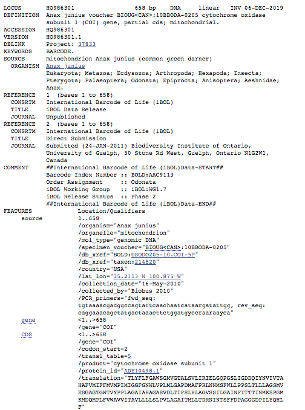
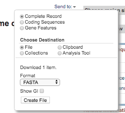

# Understanding DNA sequences and using BLAST and NCBI
*For more information about using BLAST and NCBI, see the [BLAST topic page](https://blast.ncbi.nlm.nih.gov/Blast.cgi?CMD=Web&PAGE_TYPE=BlastDocs&DOC_TYPE=BlastHelp) or NCBI's youtube video tutorial [NCBI Minute: A Beginner's Guide to Genes and Sequences at NCBI](https://www.youtube.com/watch?v=QIZ8QH6JcC8)*

## How are DNA sequences represented?
DNA sequences are usually represented in fasta or fastq format. 
<details>
  <summary>Click here to see an example of a DNA sequence in FASTA format</summary>
  
```
>HQ986301.1 
AACACTTTATTTTTTATTTGGAGCATGATCAGGGATGGTAGGAACTGCTCTAAGAGTCCTAATTCGAATT
GAATTAGGACAACCAGGATCATTAATTGGAGATGATCAAATTTATAATGTAATTGTAACAGCTCATGCTT
TTGTTATAATTTTCTTTATAGTAATACCTATTATAATTGGAGGATTTGGAAATTGATTAGTGCCACTAAT
ATTAGGAGCACCTGATATAGCTTTCCCACGATTAAATAATATAAGATTTTGATTATTACCACCTTCTCTT
ACACTTTTATTAGCAGGAAGTATAGTTGAAAGAGGTGCAGGAACAGGATGAACAGTTTATCCTCCTCTTG
CTGGTGCTATTGCTCATGCAGGAGCATCTGTAGATTTAACTATTTTTTCCCTTCACTTAGCTGGTGTATC
TTCAATTTTAGGTGCTATTAATTTTATTACTACAACAATTAATATAAAGTCACCAGGGATAAAGATAGAT
CAAATACCATTATTTGTATGAGCCGTAGTAATTACAGCTGTATTATTATTATTATCTCTTCCTGTTCTTG
CTGGTGCAATTACAATATTATTAACAGATCGAAATATTAATACATCATTCTTTGATCCTGCAGGAGGGGG
TGATCCAATTCTTTATCAACATTTATTT
```
</details>

As you can see, the first line begins with a `>` and gives a string of numbers and some descriptive words. The second line gives a series of A's, T's, C's and G's. This doesn't tell us much about what kind of dna it is, or where it is from. We can look this up using BLAST.

When you generate your own sequences using illumina, sequences are usually in fastq format. This means that there are quality scores that are important for assembly.

## How do you find the closest match to a DNA sequence using BLAST?
### What is BLAST?
BLAST stands for Basic Local Alignment Search Tool. BLAST allows you to query the NCBI database to find similar sequences.

0. Copy the sequence above and paste into the [BLAST browser](https://blast.ncbi.nlm.nih.gov/Blast.cgi?PAGE_TYPE=BlastSearch) for nucleotides. In addition to DNA sequences, you can also search for protein sequences using NCBI's [protein BLAST](https://blast.ncbi.nlm.nih.gov/Blast.cgi)
1. Scroll down to the bottom of the page and click the blue `BLAST` button. You can change the settings, but for our case, the default settings work well.
2. After a few minutes, you should get an output similar to below. The first line gives the description of the closest match to your sequence. In the second to last column, you can see the percent identity. In this case, the first sequence listed here is 100% similar to our sequence.<br/>
<details>
  <summary>Click here to see an example of BLAST output</summary>
  

</details>

3. Click on the accession number, listed in the last column. Here you can see much more information. What gene is this from? What other information can you see?
<details>
  <summary>Click here to see information about this sequence</summary>
  

This sequence is from the COI gene in the mitochondria, also known as the "barcoding gene" for animals. This means that lots of animals have had this gene sequenced, and therefore, you can look up a lot of animals using this gene.

</details>

### Congratulations! You have identified this sequence!
<details>
  <summary>Click here to see the organism this gene comes from </summary>
  


This is *Anax junius*, one of the most beautiful dragonflies in North America. During it's short adult lifespan of only a few months, it sometimes migrates thousands of miles from Canada to Mexico.
</details>

## How do I search for a specific sequence or gene using NCBI?
NCBI also allows you to find sequences from specific genes or organisms. 
4. To download the sequence, click on the fasta button on the top left. Then click `send to` then `file` then set the format as `fasta`.


*This module contributed to CBI Workshops by Rebecca Clement*
