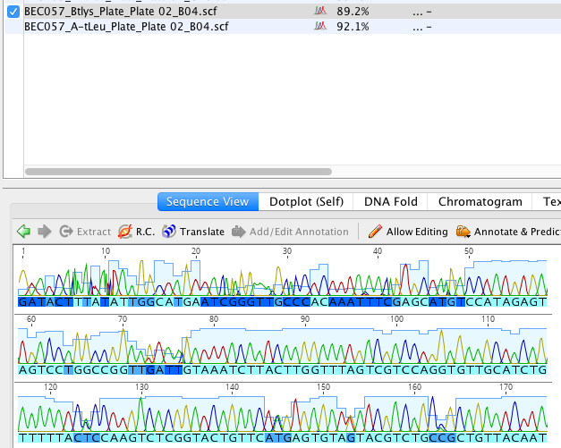
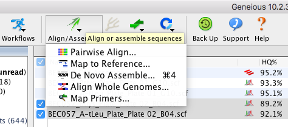
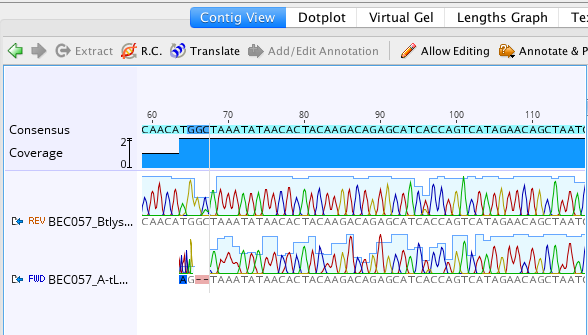
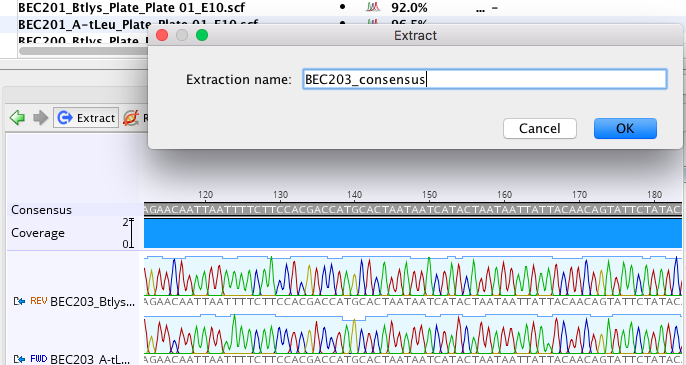
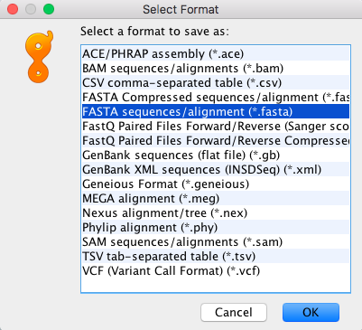

# Preparing Sanger sequences for further analysis

When you do sanger sequencing, you use a primer at the beginning of a sequence and a primer at the end of a sequence. This results in two sequences, one that starts at the beginning of a gene and one that starts at the end of the gene. 

### Geneious

Geneious is a paid software that is probably the best there is for visualizing, formatting, making contigs etc. with DNA. Although it is paid, you can get a two week free trial, and the restricted version still lets you view DNA sequences. You can [download Geneious here](https://www.geneious.com/download/).

0) Once you download geneious, you can import the .scf files by either clicking file->import->from multiple files, or by dragging and dropping the files into the geneious window. 

  
Click here to see what .scf sequences look like after they've been imported

  

Each nucleotide is represented by a different color peak. The color of the letter indicates how confident the call is, with lighter blue being more confident and darker blue being less confident. Sequences also each have a high quality score for how confident all the nucleotide calls are. You can see that score in the HQ% column. 

1) Select the forward and reverse sequences, click "Align/assemble", then select "De novo assemble". Use the default settings (unless you want something specific) then press OK.

  
Click here to see what the assembled contig looks like

  

You can see that the quality goes up when both sequences are represented and there are more light blue colored nucleotides.

2) Next, extract the consensus sequence by clicking the blue extract button.

3) When you finish making contigs and extracting consensus sequences, select all of the consensus sequence files, (you can sort the sequences by type if it makes it easier to select them), click file->export->selected documents, and then export as a fasta sequence.

Congratulations! You have successfully prepared your sanger sequences and can now [blast](phylogenetics/blast.md) them or [align](phylogenetics/align.md) them.
